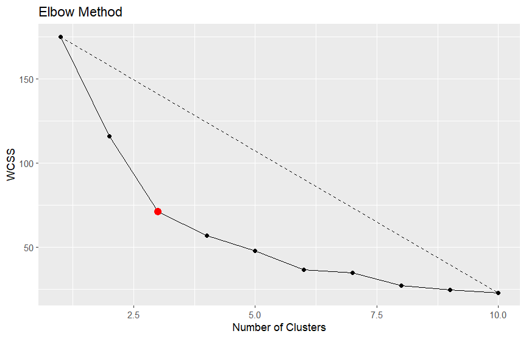

# Elbow Method for Determining Optimal Number of Clusters

## Introduction
The Elbow Method is a technique used to determine the optimal number of clusters in a dataset for K-means clustering. It helps find the "elbow" point in the Within-Cluster Sum of Squares (WCSS) plot, which indicates the number of clusters where the incremental gain in clustering quality becomes marginal. This point is considered a good trade-off between simplicity and accuracy in clustering.

## Required Packages
Before running the R script, ensure you have the following packages installed and loaded:
- `ggplot2`: A popular package for creating visualizations in R.
- `cluster`: Provides functions for clustering analysis, including the K-means algorithm.

## Dataset Generation
The R script generates a synthetic dataset with 200 observations and 2 dimensions (variables). This dataset is used for demonstration purposes to show the Elbow Method.

## Function Definitions
Two functions are defined in the script:

### Wcss Function
The `Wcss` function calculates the Within-Cluster Sum of Squares (WCSS) for a given number of clusters (`k`) using the K-means algorithm. WCSS is the sum of squared distances between each data point and the centroid of its assigned cluster.

### Elbow Method Function
The `elbowMethod` function performs the Elbow Method analysis. It computes the WCSS for a range of cluster numbers from 1 to a specified maximum number of clusters (`max_k`). The function then calculates the distances of each point on the WCSS plot from the line connecting the first and last points. The index corresponding to the largest distance is considered the "elbow" point.

## Running the Elbow Method
To determine the optimal number of clusters using the Elbow Method, call the `elbowMethod` function with your dataset and specify the maximum number of clusters to consider (e.g., `max_k = 10`).

## Preview of Result
The Elbow Method generates a plot that helps identify the optimal number of clusters. Below is an example plot obtained by calling the `elbowMethod` function with the generated dataset and `max_k = 10`:

In the plot, the x-axis represents the number of clusters (`k`), and the y-axis represents the Within-Cluster Sum of Squares (WCSS) for each value of `k`. The "elbow" point, where the plot shows a sharp bend or plateau, indicates the recommended number of clusters.

## Conclusion
The Elbow Method is a useful tool for selecting the appropriate number of clusters in K-means clustering. It aids in finding the point at which the WCSS plot exhibits an "elbow," indicating the optimal number of clusters. By striking a balance between model simplicity and accuracy, this technique helps in making informed decisions when applying clustering algorithms to real-world datasets.

